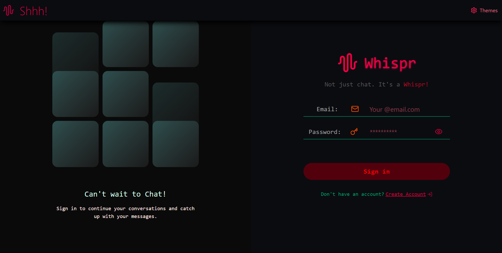
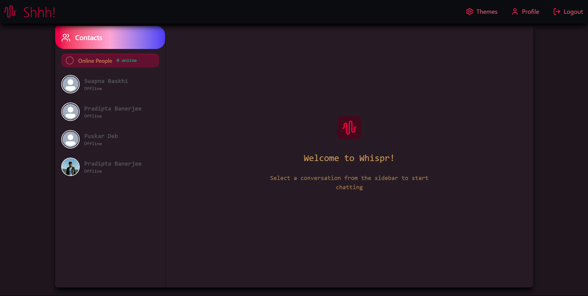

# "Bring life to your messages before you hit send." -whispr

# Whispr 💬

A real-time chat application built with **Node.js**, **Express**, **Socket.IO**, and **React**, featuring JWT authentication, image attachments, and online presence tracking.

---

### 🌐 Ready to Whispr (Live)
👉 [Whispr - a chat app][https://whispr-a-chat-app.onrender.com](https://whispr-a-chat-app.onrender.com)
---
| Login | Chat UI |
|-------|---------|
|  |  |

## 🚀 Features

* Secure user authentication with JWT and HTTP-only cookies
* Real-time messaging with **Socket.IO** (typing indicators, online/offline presence)
* One-to-one chats with text and image support
* Auto-scroll and smooth UI experience
* MongoDB backend support for user profiles (name, email, profile picture) and pictures for Cloudinary service.
* Responsive React & TailwindCSS frontend suitable for every device.
* Backend served together with static React build for seamless deployment

---

## Prerequisites

* **Node.js** ≥ 16.x
* **Express** < v4.21.1 !important to deploy without error
* **npm** 
* **MongoDB** (Local or Atlas)
* **Cloudinary**

---
## 🛠️ Tech Stack

| Frontend | Backend |
|----------|---------|
| React + Vite | Express.js |
| Zustand | MongoDB + Mongoose |
| Tailwind CSS | Socket.IO |
| React Hot Toast | Cloudinary (for profile & image uploads) |

---

## 🛠️ Setup

**Clone the repo:**

```bash
git clone https://github.com/rou-nak-cloud/Whispr.git
cd Whispr
```

**Install dependencies:**

```bash
npm install               # installs both backend/frontend using root scripts
```

**Environment variables:**

Create a `.env` in the `Backend` folder with:

```ini
PORT=5000
MONGODB_URI=your_mongo_uri
JWT_SECRET=strong-secret
CLOUDINARY_CLOUD_NAME=xxx
CLOUDINARY_API_KEY=xxx
CLOUDINARY_API_SECRET=xxx
NODE_ENV=development
```

---

## 🔁 Run Locally

**Start both servers at once:**

```bash
npm run dev        # starts express backend + React frontend via Vite
```

* Backend runs at `http://localhost:5000`
* Frontend runs at `http://localhost:5173`

---

## 🧪 Use the App

1. Open your browser at `http://localhost:5173`
2. **Sign up** with a name, email, and password
3. Log in to access the chat interface
4. Select a user on the sidebar to chat
5. Send text or attach images—they’ll appear in realtime 🖼️
6. Watch your profile picture update in Settings

---

## 🧹 Code Overview

### Backend (`Backend/src`)

* `server.js` — entrypoint, middleware, routes, and Socket.IO setup
* `routes/` — `auth.route.js`, `message.route.js`
* `controllers/` — business logic for auth and messages
* `middlewares/` — JWT auth protection
* `lib/` — `db.server.js` (Mongo connection), `socket.js` (Socket.IO server)

### Frontend (`Frontend/src`)

* `App.jsx` — routing and authentication state
* Pages: `HomePage`, `LoginPage`, `SignUpPage`, `ProfilePage`, `SettingsPage`
* Components: `Navbar`, `Sidebar`, `ChatContainer`, `MessageInput`
* State logic: `useAuthStore.js`, `useChatStore.js`, `useThemeStore.js` (Zustand)

---

## 🎨 Styling & UI

* Styled with **TailwindCSS** + **daisyUI**
* Modern UI with smooth transitions, dark mode ready
* Chat bubbles, image previews, auto-scroll functionality

---
---

## 📦 2. GitHub Release Note (v1.0.0)

```md
🎉 Initial Release – v1.0.0

🚀 Whispr is a real-time, full-stack chat application built using MERN + Socket.IO.

###  What's Included:
- Real-time chat via Socket.IO
- Sign up / Log in / Logout
- Zustand global store
- Cloudinary uploads for images
- Dark-themed modern UI
- Mobile-responsive UI
- Deployed with Render

👉 [Live Demo](https://whispr-a-chat-app.onrender.com)

🚀 Deployment --
🔧 Backend: Deployed to Render
🌐 Frontend: Bundled with Render or you can host via Netlify/Vercel


## ✅ Contributing

PRs and feature requests are welcome! Fork the repo, work on a branch, and open a PR.
Ensure linting, testing, and documentation are updated.
---

*Made with ❤️ by rou-nak-cloud and ❤️ mePradipta30*

